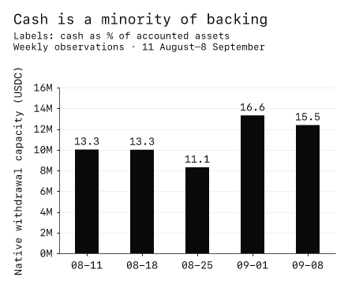
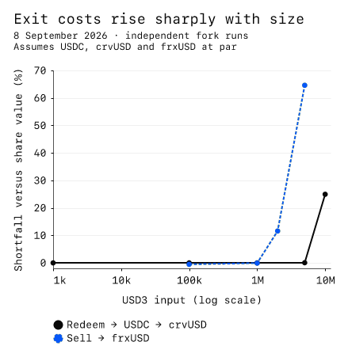

---
{
  "title": "Asset Review: 3Jane USD3",
  "description": "USD3 is a transferable share in a managed credit pool.",
  "publishedAt": "2026-09-08",
  "tokenLogo": "../../assets/reports/usd3-ethereum/figures/token-logo.svg",
  "draft": false,
  "reviewedBy": [
    "Wavey"
  ]
}
---

# Asset Review:  3Jane USD3

| Item | Detail |
| --- | --- |
| Asset |  3Jane USD3 |
| Chain | Ethereum ([0x056B…5eCc](https://etherscan.io/address/0x056B269Eb1f75477a8666ae8C7fE01b64dD55eCc)) |
| Review date | 8 September 2026 |

## Summary

USD3 is a transferable share in a managed credit pool. Using it as lending collateral exposes borrowers and lenders to changes in credit value and available exit liquidity. Most backing depends on offchain lending and collection. At the time of writing:

- **Backing concentration:** $80.00 million of accounted assets, with Slope whole loans representing approximately 68.4% of the pool. Accounted loan value does not establish collectibility.
- **Immediate liquidity:** $12.39 million available for native USDC withdrawals, or 15.5% of accounted assets, subject to Aave and wrapper availability.
- **Loss protection:** $7.52 million of junior capital, or 9.4% of the pool, absorbs recognized losses before external senior holders; its size can change. Offchain impairments must reach the accounts before this protection operates, and insurance assistance is discretionary.
- **Settlement constraints:** Redeeming 10 million USD3 to USDC succeeded, but conversion through the tested crvUSD pool returned 24.9% below share value, assuming stablecoins at par. This result does not establish optimal routing or capacity for a concentrated unwind.
- **Unresolved evidence:** Executed facility protections and loan-level evidence were unavailable. Approximately $486,000 remained unreconciled across differently dated onchain and facility records; the difference is not an established loss.

## Asset overview

USD3 is an ERC-4626 vault share denominated in USDC.[^addresses] It earns yield through an increasing USDC share value; its symbol does not imply redemption for exactly one dollar. The following figures describe its claim and accounting at the time of writing.[^suppliers]

| Item | Observed asset and claim |
| --- | --- |
| Junior tranche | [sUSD3](https://etherscan.io/token/0xf689555121e529Ff0463e191F9Bd9d1E496164a7) holds USD3 and bears junior losses in exchange for additional yield |
| USD3 supply | 68.049 million shares |
| Accounted share value | 1.17561978 USDC per USD3 |

Deposits enter a pool combining Aave liquidity, crypto credit lines and fintech lending; older descriptions of an entirely Aave-backed bootstrap product do not describe this deployment. These underlying exposures determine the value and recoverability of USD3 pledged as collateral.[^evolving]

## Issuer and organization

The May 2026 shift toward fintech facilities adds reliance on loan originators, servicers, bank rails and legal enforcement. Public records identify the following organizations and people, but do not establish the complete ownership or enforcement structure:

- **Operator:** September 2025 website terms name Tulkum Assets Corp., a Panamanian corporation, together with affiliates. The published advance agreement also names the 3Jane Foundation.[^terms][^advance]
- **Founder and funding:** Independent reporting corroborates Jacob Chudnovsky's founder role and the June 2025 announcement of a $5.2 million seed round led by Paradigm. Historical company funding does not establish a guarantee, committed recapitalization facility or current resources available to holders.[^funding]
- **Banking rail:** 3Jane identifies Erebor; the OCC records its national bank charter as effective on 6 February 2026. The charter does not establish ownership, availability or insurance coverage of 3Jane's reported balances.[^erebor][^occ]

The published documents do not identify every entity holding fintech receivables. We did not obtain corporate registry extracts, audited operator financial statements or executed assignments demonstrating an individual token holder's enforceable claim against each underlying borrower.[^terms][^advance]

3Jane describes bankruptcy-remote special purpose vehicles, security interests and controlled collection accounts for warehouse lending, and true sales for purchased whole loans. Those protections depend on actual contracts, perfection of security, account control and functioning servicing. Public facility data identifies a “cold backup servicer” without naming it. We could not verify the executed security, servicing, account-control or tokenholder enforcement arrangements. The available website terms predate the fintech transition and contain broad risk allocations and liability limitations; they do not resolve these facility-specific questions.[^legal][^terms][^facility-data]

## Mechanics and dependencies

### What the pool owns and what the dashboard measures

USD3 supplies wrapped Aave USDC into 3Jane's [MorphoCredit deployment](https://etherscan.io/address/0xDe6e08ac208088cc62812Ba30608D852c6B0EcBc). Borrowers draw against assigned credit limits. The market's collateral field is part of that credit accounting; it does not mean an equivalent quantity of USDC is posted as liquidatable collateral. Unborrowed wrapped USDC supplies the immediate withdrawal reserve. The chain of dependencies includes USDC, Aave, its wrapper, MorphoCredit and USD3's own accounting.[^core-code]

On 8 September, the onchain accounts showed the following amounts. Figures rounded to millions are not additive across the two accounting layers.

| Onchain accounting | USDC value | Meaning |
| --- | ---: | --- |
| Accounted USD3 pool assets | $80.000m | Value used for share accounting |
| Live strategy asset calculation | $80.017m | Includes accrued value awaiting reporting |
| Available native withdrawals | $12.388m | Unborrowed liquidity, subject to dependency availability |
| Outstanding credit | $67.629m | Borrower claims, not withdrawal cash |
| Of credit: fintech staging account | $65.852m | Aggregates offchain activity under one onchain borrower |
| Of credit: other borrower accounts | $1.777m | Remaining crypto credit exposure |

The app identifies the fintech borrower as its Erebor staging multisig. The account was a 1-of-1 Safe controlled by the protocol's 3-of-5 Safe. It accounts for 97.4% of outstanding credit. Splitting receivables among many end borrowers therefore does not remove the common operational and accounting dependency at this account.

The public facility figures retrieved on 8 September report $54.737 million of Slope principal, $5.465 million of LendSwift principal, $0.578 million of accrued facility interest and $4.587 million of bank staging cash. These sum to $65.366 million, approximately $0.486 million below the staging account's onchain debt. Facility data is dated 3–4 September, while the chain observation is 8 September. Accrual conventions, servicing updates or cash movements may explain the difference; a matched-date reconciliation is required to establish which. Bank cash is also outside the immediately redeemable onchain reserve.[^facility-data]

[Accountable's dashboard](https://accountable.3jane.xyz/dashboard) reported roughly $80.017 million in assets against $80.000 million in liabilities, a ratio of 1.000209. In the saved response, the headline asset value is assigned to the Morpho Credit position. Its underlying Slope and LendSwift document inputs were dated 28 August, older than the facility data above. This provides visibility into reported accounting and source freshness. It does not independently establish receivable collectibility, enforceable title or cash available on demand. We did not independently validate the dashboard's cryptographic attestations.[^accountable]

### Two different types of fintech credit

Slope whole loans dominate the pool, while LendSwift provides a different, secured lending exposure. The issuer's facility records dated 3–4 September distinguish the two structures.[^facility-data][^slope][^lendswift]

| Slope | LendSwift |
| --- | --- |
| Structure: Purchased portfolio of 1,536 whole loans | Structure: Senior warehouse secured against consumer receivables |
| Principal: $54.737 million | Principal: $5.465 million |
| Timing: Average remaining loan term of 45 days | Timing: 12 months revolving, then six months of amortization; final maturity November 2027 |

At the reported Slope snapshot, 96.3% was current and approximately 0.97% was at least 30 days late. However, about 71.1% of outstanding principal came from July and August originations. Reported zero charge-offs therefore reflects a young portfolio, with limited evidence of performance through a full loss cycle.[^facility-data]

A whole-loan purchase transfers the purchased loan's credit risk to the buyer. The first-loss equity described for warehouse facilities should not be applied automatically to the Slope position. With the $7.52 million junior buffer available at the time of writing, a 13.7% net principal loss on Slope alone would exhaust that buffer, ignoring earnings, recoveries, locked profits, other losses and changes in junior capital. This is a concentration scenario, not a loss forecast.

LendSwift's protection depends on its borrowing base and collections. On 4 September, disclosed eligible collateral after haircuts was $8.047 million against $5.533 million of principal and interest obligations: 45.4% overcollateralization, compared with a 33% contractual threshold reported by the issuer. That is facility-level protection, separate from sUSD3's pool-level junior capital.[^facility-data][^lendswift]

The borrowing-base calculation reconciles: $11.257 million gross collateral plus $1.337 million collection cash, less $4.547 million haircuts, equals $8.047 million. Approximately 30.7% of gross receivable balances were more than 30 days late. This does not by itself mean the senior facility defaulted; delinquency haircuts already exclude part of the portfolio from eligible backing. It does mean collections and the accuracy of those exclusions are consequential. Across 16 disclosed weekly observations, overcollateralization reached a low of 34.7% on 7 August, only 1.7 percentage points above the reported threshold. Weekly samples cannot rule out intervening breaches.[^facility-data]

A roughly 120-day underlying loan life does not mean USD3 receives all facility principal back within 120 days: collections can fund new loans during the revolving period. The public summary reports a weighted-average borrower APR of approximately 693%. Borrower affordability and state-specific lending and collection enforceability are therefore material; we did not verify the underlying loan contracts or compliance. Servicing continuity and collection-account access also matter when the borrowing base satisfies its stated test.[^facility-data]

### Junior protection and recognition of losses

At the time of writing, the USD3 held by sUSD3 was worth $7.522 million, or 9.40% of the pool. External senior claims were approximately $72.478 million. The junior holdings are already included in USD3's $80 million asset figure; adding them again as reserves would double count them.

When USD3 reports a loss, the implementation first uses locked profit shares, then burns USD3 held by sUSD3 up to the available balance. Loss beyond those layers reduces senior share value. The current junior withdrawal floor is $7.5 million, leaving only approximately $21,580 above the floor. This restricts ordinary junior withdrawals; it neither prevents losses nor guarantees a permanent 9.4% cushion. Governance can change the floor, and shutdown changes junior exit restrictions. The proportional minimum-backing setting was disabled.[^usd3-code][^susd3-code]

The insurance fund held roughly $1 million equivalent in wrapped USDC. Credit settlement can draw a caller-selected amount, including zero, before writing off remaining debt. The deployed route for this action runs through the 24-hour ownership timelock. Coverage is neither automatic nor required before junior losses, so we do not count the fund as an unconditional additional senior guarantee.[^insurance]

Permission to hold shares does not ensure immediate entry or exit:

- **USD3:** No configured commitment delay or depositor whitelist; transfers do not require recipient approval. The $80 million supply cap nevertheless left only about $42 of deposit capacity, below the $1,000 minimum for a new holder.
- **sUSD3:** A 30-day withdrawal cooldown and no initial commitment period, with ordinary withdrawals also constrained by the junior floor described above.

USD3 directs a 7.5% performance fee on reported profits to the junior layer; the Yearn protocol fee was zero. Profits unlock over three days. These settings can support junior capital through earnings, but they do not provide cash or compensate for an unrecognized credit impairment.[^usd3-code]

Borrower-level loss recognition remains operational. At the time of writing, the dominant fintech borrower had no posted repayment obligation and markdowns were disabled for that account. A zero onchain delinquency indicator therefore cannot establish that every underlying loan is current. Where enabled, the configured markdown schedule can take 730 days to reach full markdown after its trigger. USD3 blocks ordinary exits when its live calculation already shows an unreported loss, but this check cannot detect a stale or missing underlying borrower markdown. Early withdrawals at overstated value can shift losses onto remaining holders.[^core-code][^usd3-code][^guardian]

## Governance and control

The same protocol Safe controls both routine management and delayed upgrades, with a separate immediate emergency path. On 8 September, the main control paths were:

| Authority | Observed control and delay | Holder consequence |
| --- | --- | --- |
| Vault management, protocol configuration and credit administration ownership | 24-hour timelock; protocol Safe has proposal and execution roles | Can change limits, fees and material operating settings; management can shut down vaults |
| USD3, sUSD3, MorphoCredit and configuration proxy upgrades | ProxyAdmins owned by a seven-day timelock; same Safe has proposal and execution roles | Code and holder protections can change after the delay |
| Protocol Safe | 3 signatures from 5 owners; no enabled modules found | Threshold is verified; signer identities and operational independence are not established |
| Emergency controller | Contract controlled by the protocol Safe; the Safe and a second authorized account can act immediately | Can pause new activity, zero selected caps and revoke individual credit lines |

The emergency controller cannot unpause activity, grant arbitrary credit limits, post repayment obligations or settle insurance: its deployed entrypoints expose only the restricted actions above. Those broader credit operations remain available through the 24-hour ownership timelock. The optional proof verifier was unset, so credit assignment did not enforce the advertised proof-validation path.[^emergency][^config-code][^core-code]

The timelocks create notice for their own actions; they do not make offchain underwriting, repayment reporting or bank transfers autonomous. The same control structure ultimately operates the staging borrower and governs the pool lending to it.

## Liquidity and market structure

### Native withdrawals and their history

USD3 redeems to USDC from available unborrowed liquidity. At the time of writing, $12.388 million was available, covering 15.5% of accounted assets. It also depends on Aave and the wrapper continuing to permit withdrawal; total assets in the global wrapper are not all available to USD3.

*Source: historical Ethereum balances checked at five dates from 11 August to 8 September 2026. These are five snapshots, not continuous minimum liquidity or a withdrawal commitment.*

Over the bounded August–September event window, we identified 498 completed withdrawals totaling $4.703 million USDC, with a largest withdrawal of $650,913. Ten reporting events recorded no loss. The longest gap between those reports was approximately 84.4 hours. Completed events establish historical throughput; they reveal neither failed exit attempts nor unrecognized underlying credit losses.

3Jane's separate Levered Callable Capital product can bring new USDC into USD3 after a funding call. Its launch documentation specifies a nine-day funding window and default auctions that may remain partly unfilled. Promised capital is therefore not same-transaction withdrawal liquidity, and we do not add it to the $12.388 million reserve.[^lcc]

### Secondary depth and concentrated holdings

The identified [Curve USD3/frxUSD pool](https://etherscan.io/address/0x7BA89Bc658c07569cfa6d7947adAA80181a24568) held approximately 2.082 million frxUSD and 243,152 USD3 on 8 September, approximately $2.37 million combined at accounting value and frxUSD parity. A large pool value does not mean both sides can absorb that amount of selling. Approximately 97.2% of LP supply sat in the gauge; beneficial LP ownership was not resolved.[^curve-pool]

Curve's public data also showed CRV rewards for this pool. That depth does not establish how much liquidity would remain after rewards fall or large LPs withdraw.[^curve-pool]

On 8 September, approximately 48.0% of USD3 was held in a Pendle SY contract, 21.6% in the canonical Morpho contract, and 9.4% in sUSD3. The first two aggregate downstream users and should not be described as two beneficial owners. They nevertheless concentrate custody and potential unwind paths: redemptions from integrated markets can arrive together. The canonical Morpho holding USD3 is distinct from 3Jane's MorphoCredit deployment lending the underlying funds.

The Curve event window contained 1,428 swaps. Among trades involving at least 100 USD3, observed exchange ratios ranged from 1.1703 to 1.1999 frxUSD per USD3; the largest trade involved approximately 426,429 USD3. These are raw executed token ratios, affected by share accrual and trading conditions, not an independently verified USD price history.

### Complete exit tests

Native redemption can succeed while the final conversion produces substantially less than share value. Our tests ran a receiving contract with existing USD3 inventory on a local Ethereum fork of the 8 September state. Native tests redeemed USD3 to USDC with zero permitted redemption loss and then exchanged all proceeds through the identified USDC/crvUSD pool in one call. Secondary tests sold USD3 directly to frxUSD. Each size began from the same state.

| USD3 input | Native redemption followed by crvUSD settlement | Direct Curve sale to frxUSD |
| ---: | ---: | ---: |
| 100,000 | 117,578 crvUSD | 118,189 frxUSD |
| 1,000,000 | 1,175,681 crvUSD | 1,176,772 frxUSD |
| 2,000,000 | Not tested | 2,078,777 frxUSD |
| 5,000,000 | 5,875,782 crvUSD | 2,080,815 frxUSD |
| 10,000,000 | 8,823,676 crvUSD | Not tested |
| 11,000,000 | Native redemption reverted; inventory preserved | Not tested |

*Source: local execution tests using Ethereum state from 8 September 2026. Shortfall compares output token units with USD3's USDC accounting value, assuming USDC, crvUSD and frxUSD at par. Negative values indicate a premium. Lines connect independent tested sizes; they do not prove intermediate capacity.*

All ten tests passed their assertions, including the expected cash-limit revert. The largest native execution first received $11.756 million USDC, then lost substantial value on the crvUSD conversion. The tests include pool fees and price impact, but exclude gas, MEV, concurrent withdrawals and changes in stablecoin prices. Swap minimum output was deliberately zero to measure execution; this is not a production protection setting. Inventory impersonation only supplied already-held shares to the receiver. We did not simulate acquiring those shares through a lending liquidation or establish an optimal route.[^crvusd-pool]

## Valuation and oracle considerations

USD3's accounting conversion is a USDC claim per share, not a realizable dollar price. It combines reported credit values, Aave wrapper conversion and profit/loss reporting. If underlying loans deteriorate before markdowns reach that accounting, an oracle built only on the share conversion can continue valuing impaired claims at the old level.

The Curve pool incorporates the ERC-4626 share rate. On 8 September, its stored USD3 conversion reflected approximately 1.175619 USDC per share, while its internal `price_oracle(0)` read approximately 1.008482. That internal value is normalized by the pool's rate accounting; treating it directly as dollars per USD3 would use the wrong units. A dollar valuation must account for rate normalization, coin orientation and frxUSD's own dollar price.[^curve-code]

Pool smoothing introduces lag and does not solve stale credit valuation. An integration using this pool for both pricing and exits would share one dependency: LP withdrawals reduce sell capacity while selling pressure affects the price signal. USDC freezes or depegs affect the native claim, while frxUSD and crvUSD introduce separate settlement-asset exposures on the tested routes. Token proceeds do not establish dollar proceeds during a stablecoin disruption.

## Security and operational history

The USD3 proxy dates to August 2025 and has been upgraded repeatedly. We independently verified a shutdown on 19 April 2026, followed by restoration of the active state in the 1 May upgrade. The current implementation was installed on 6 June. We did not find a public explanation establishing the shutdown's cause or an incident-specific postmortem; these transactions do not by themselves establish an exploit.[^shutdown][^restart][^upgrade]

Shutdown stops deposits but does not itself block funded USD3 withdrawals. In separate forks of the September state, a 100,000 USD3 redemption returned 117,561.978409 USDC both before and after shutdown, with zero permitted redemption loss. This does not reconstruct April's exit conditions. Guardian identified that failed upstream valuation can block even funded shutdown exits; the deployed code retains that dependency. We did not reproduce its impaired-credit scenario.[^usd3-code][^guardian]

### Audit history

| Review | Relevant scope and findings | Applicability |
| --- | --- | --- |
| Veridise, August 2025 | MorphoCredit and wrapper architecture; critical market-drain and high-severity withdrawal/lock findings reported fixed | Earlier implementation; not assurance over later fintech assets or all subsequent changes |
| Sherlock, August 2025 | Core credit and vault accounting; seven high and five medium findings | Historical review; report status wording does not establish that every finding was fixed |
| Electisec, October 2025 | Vault, tranche and integration changes; high-severity Pendle YT issue removed, some medium findings deferred | Earlier product design with subsequent revisions |
| Sherlock competition, October 2025 | One high and seven medium findings, including yield and accounting issues | Published PDF is marked preliminary and contains placeholders; full remediation cannot be inferred |
| Electisec/yAudit, May 2026 | USD3/sUSD3 changes; three high findings reported fixed, alongside accounting and shutdown fixes | Checked tranche source matches the final reviewed revision |
| Guardian, August 2026 | LCC and shared USD3/credit code; acknowledged stale-markdown and shutdown-valuation risks | Relevant shared paths remain deployed; the full audited revision is not live |

The linked original reports contain the full scopes and remediation records.[^veridise][^sherlock][^electisec][^sherlock2][^may-audit][^guardian]

Current verified USD3, sUSD3 and shared hook source matched the May audit's final revision; configuration-library differences prevent treating the whole deployment as identical. Guardian's August review also covers these shared contracts, despite its LCC label. Its later revision includes changes absent from the deployment, so fixes require individual applicability checks.

Two May findings were accepted with operational mitigations: stale borrower premiums and stale borrower markdowns. The response to premium staleness relied partly on a profit-unlock period of at least seven days; the setting on 8 September was three days. These findings matter because entry, loss recognition and exit pricing can depend on timely operator updates. Code audits do not validate receivable values, legal security or bank balances.[^may-audit]

## LlamaLend collateral considerations

For a prospective LlamaLend v2 market borrowing crvUSD, delayed credit recognition can increase borrowers' liquidation risk when losses reach the valuation, while limited exit proceeds can impair lenders' recovery. No deployed USD3 market was identified in the Curve lending API response checked on 8 September; this does not establish factory-wide absence, and no existing controller, LLAMMA or oracle configuration was assessed.

- **Valuation delay:** A loan impairment can become known offchain before the share price reflects it, followed by a discontinuous price change when recognized. LLAMMA trading does not make fintech receivables settle onchain or replenish exhausted native cash.
- **Debt-token proceeds:** A collateral lender needs realizable crvUSD when borrowers cannot repay. Native reserves and secondary sell capacity are smaller than reported backing, and even successful USDC redemption can leave insufficient crvUSD proceeds when the settlement pool becomes imbalanced.
- **Execution scope:** The fork results establish redemption and crvUSD settlement for a contract already holding USD3 at the tested state and sizes. They do not establish performance inside a particular liquidation callback, during shutdown, after a credit markdown or after competing withdrawals.

Concentrated downstream custody, a common underwriting controller and reliance on delayed offchain information make correlated exits plausible. Market-specific assessment would require the actual v2 contracts and oracle wiring, tested liquidation callbacks and debt-token settlement under depleted liquidity and recognized-loss states. This review does not infer a safe loan size, collateral factor or other market parameter from the successful tests.

## Monitoring and open questions

- **Reconciliation:** Compare onchain debt with facility principal, accrued interest, bank cash and remittances on the same date. Investigate persistent differences through servicing and cash ledgers; public aggregates cannot establish loan ownership, absence of double pledging or accurate individual arrears.
- **Junior protection:** Reassess coverage when junior holdings, recognized losses, locked profits, the withdrawal floor or shutdown state change. A stable nominal floor does not preserve protection if losses consume the balance or governance changes its enforcement.
- **Loss recognition:** Investigate missing obligations, disabled markdowns, stale premiums, reporting gaps or changes in who controls them; these can make an onchain current status uninformative. Reconcile the three-day profit unlock with the audit's stated mitigation.
- **Exit capacity:** Repeat complete route tests after material changes in native cash, Aave availability, destination depth, LP rewards or concentrated withdrawals. Include venues shared by pricing and exits.
- **Facility performance:** Track LendSwift's borrowing-base cushion and collections, and Slope's arrears as its young portfolio matures. Deterioration should prompt reassessment of collateral eligibility, recoveries and pool-level loss protection.
- **Enforcement evidence:** Obtain executed security and account-control documents, a named backup servicer, reporting obligations and the chain of tokenholder enforcement rights. Until verified, the described bankruptcy and collection protections remain uncertain.
- **Operating continuity:** Review actions through both timelocks, emergency interventions, upgrades and bank or servicer changes for effects on control and access. A public April shutdown account and current operator financial resources would improve assessment of disruption management.

[^addresses]: 3Jane, [official Ethereum deployments](https://docs.3jane.xyz/developers/addresses), retrieved 8 September 2026.
[^suppliers]: 3Jane, [USD3 and sUSD3 suppliers](https://docs.3jane.xyz/usd3-susd3/suppliers), current documentation retrieved 8 September 2026.
[^evolving]: 3Jane, [3Jane is evolving](https://www.3jane.xyz/reports/3jane-is-evolving), 5 May 2026.
[^terms]: Tulkum Assets Corp., [website terms of use](https://www.3jane.xyz/pdf/terms-of-service.pdf), revised 1 September 2025. Legal arrangements above are described as disclosures or unresolved evidence, not a legal opinion.
[^advance]: 3Jane, [published advance agreement](https://www.3jane.xyz/pdf/advance.pdf), retrieved 8 September 2026; a template does not establish execution for the current fintech facilities.
[^funding]: RT Watson, The Block, [Paradigm leads seed round in 3Jane](https://www.theblock.co/amp/post/356872/paradigm-leads-5-million-seed-round-in-crypto-credit-startup-3jane), 4 June 2025; 3Jane, [funding announcement](https://www.3jane.xyz/reports/3jane-raises-5-2m-led-by-paradigm-to-enable-cryptonative-credit-creation), 4 June 2025.
[^erebor]: 3Jane, [Erebor fintech facility funding](https://www.3jane.xyz/reports/3jane-x-erebor-fintech-facility-funding), 19 May 2026, and [banking rail documentation](https://docs.3jane.xyz/backing/fcc/banking-rail-erebor).
[^occ]: Office of the Comptroller of the Currency, [Erebor charter application record](https://apps.occ.gov/CAS/home/details?FilingID=NGzrdlDperpA&FilingSubtypeID=1101&FilingTypeID=2), control 2025-Charter-342076, effective 6 February 2026.
[^legal]: 3Jane, [fintech legal structuring](https://docs.3jane.xyz/backing/fcc/legal-structuring) and [warehouse and forward-flow structures](https://docs.3jane.xyz/backing/fcc/warehouse-and-forward-flows), retrieved 8 September 2026.
[^facility-data]: 3Jane, [public application](https://app.3jane.xyz/) and [facility descriptions](https://docs.3jane.xyz/backing/fcc/facilities). Figures come from the application's public data, retrieved 8 September 2026; loan/facility reporting dates differ as stated. These are issuer-provided figures, not an independent loan audit.
[^accountable]: Accountable, [3Jane dashboard](https://accountable.3jane.xyz/dashboard), response saved 8 September 2026. Headline and source-document timestamps are separately preserved in the evidence.
[^slope]: 3Jane, [Slope whole-loan sale announcement](https://www.3jane.xyz/reports/3jane-x-slope-whole-loan-sale), 8 June 2026. Current amounts and arrears are from the later public facility response.
[^lendswift]: 3Jane, [LendSwift senior warehouse announcement](https://www.3jane.xyz/reports/3jane-x-lendswift-senior-warehouse-facility), 29 May 2026, and [credit enhancement and loss distribution](https://docs.3jane.xyz/backing/fcc/credit-enhancement-and-loss-distribution).
[^core-code]: 3Jane, [protocol source at retained revision](https://github.com/3jane-protocol/moneymarket-contracts/tree/c53235d5d2f4162d3cc4d7e385a0a7c39689b54d); [MorphoCredit implementation](https://etherscan.io/address/0xb326c390a607b4317A1D205dfF4aFb1A42CA7157#code). The configuration and figures in this review were checked against Ethereum state from 8 September 2026.
[^usd3-code]: [Current USD3 implementation source](https://etherscan.io/address/0xB606fB370Eaaad03d71B49aE5E42AA4aEC7458D9#code), including the loss report, liquidity limits and junior fee logic; [delegated TokenizedStrategy](https://etherscan.io/address/0xd377919fa87120584b21279a491f82d5265a139c#code). The figures were checked on 8 September; the explorer links identify the contracts rather than substantiate historical balances.
[^susd3-code]: [Current sUSD3 implementation source](https://etherscan.io/address/0x529cbf11fFbC272D63858ca40A2C7F2695712073#code), including ordinary withdrawal limits and shutdown behavior.
[^config-code]: [Configuration implementation](https://etherscan.io/address/0x64Bc68ea388e42c73747668122eee3A5bfB70b98#code), including constrained emergency changes; [24-hour timelock](https://etherscan.io/address/0x1dCcD4628d48a50C1A7adEA3848bcC869f08f8C2) and [seven-day timelock](https://etherscan.io/address/0x3D3C41419Ab401cd25055E8f9421D7D96d887885). Ownership, thresholds and delays were checked on 8 September.
[^lcc]: 3Jane, [LCC flow of funds](https://docs.3jane.xyz/levered-callable-capital-lcc/mechanism/flow-of-funds) and [LCC risks](https://docs.3jane.xyz/levered-callable-capital-lcc/risks), retrieved 8 September 2026. LCC's separate code and margin assets were not included in USD3 withdrawal capacity.
[^curve-pool]: Curve, [official Ethereum StableSwap NG pool data](https://api.curve.finance/v1/getPools/ethereum/factory-stable-ng), used for discovery; balances and quotes were checked on 8 September, and execution results come from local simulations of that state.
[^curve-code]: [USD3/frxUSD pool source](https://etherscan.io/address/0x7BA89Bc658c07569cfa6d7947adAA80181a24568#code), StableSwap NG v7.0.0 rate and oracle accounting.
[^crvusd-pool]: [Tested USDC/crvUSD pool](https://etherscan.io/address/0x4DEcE678ceceb27446b35C672dC7d61F30bAD69E#code). The token wiring and complete outcomes were independently checked on our fork.
[^shutdown]: Ethereum, [19 April 2026 shutdown transaction](https://etherscan.io/tx/0x4c1611d4cad8436f243122a7c30042253c0dacc12995554d825f3a81ef1aab87). We corroborated the receipt and before/after shutdown state through RPC.
[^restart]: Ethereum, [1 May 2026 upgrade and restart](https://etherscan.io/tx/0x3aaf4b1ed755a946c7b3e9bebd2f6d657f78e50490a629f81b40a6dd974aa9af), corroborated against receipt and before/after state.
[^upgrade]: Ethereum, [6 June 2026 implementation upgrade](https://etherscan.io/tx/0xa519a9dcb17bae769b56288076c3bf131a0483b03cdd590ae8cb607daf7d4db3).
[^veridise]: Veridise, [August 2025 audit](https://github.com/3jane-protocol/audits/blob/main/veridise-audit.pdf), review 7–18 August; revised report 29 August 2025.
[^sherlock]: Sherlock, [August 2025 audit](https://github.com/3jane-protocol/audits/blob/main/sherlock-audit.pdf), review 4–20 August 2025.
[^electisec]: Electisec, [October 2025 audit](https://github.com/3jane-protocol/audits/blob/main/electisec-audit.pdf), 18 October 2025.
[^sherlock2]: Sherlock, [October 2025 competition report](https://github.com/3jane-protocol/audits/blob/main/sherlock-2-audit.pdf), published preliminary version.
[^may-audit]: Electisec/yAudit, [May 2026 USD3/sUSD3 audit](https://github.com/3jane-protocol/audits/blob/main/yaudit-usd3-susd3-may-2026-audit.pdf), review 26–28 May 2026; final revision 52bf5322f53ed2e59fa31c994f76d4253d9b9172. Accepted operational findings include §§2.6.1 and 2.6.3.
[^emergency]: [Deployed EmergencyController source](https://etherscan.io/address/0x84b31b84917485e221305edf590b8e3660d2e051#code). Runtime correspondence, role members and downstream permissions were checked against Ethereum state from 8 September.
[^insurance]: [CreditLine settlement source](https://etherscan.io/address/0x26389b03298BA5DA0664FfD6bF78cF3A7820c6A9#code) and [InsuranceFund source](https://etherscan.io/address/0x4507B5B23340D248457d955a211C8B0634D29935#code). The fund balance and authority to use it were checked on 8 September.
[^guardian]: Guardian, [August 2026 LCC audit](https://github.com/3jane-protocol/audits/blob/main/guardian-lcc-august-2026-audit.pdf), 27 August 2026, findings M-07 and M-11. We compared the reviewed and remediation revisions with saved deployed source; this was a bounded applicability check, not an independent security audit.
