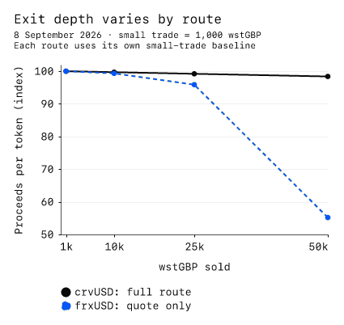

---
{
  "title": "Asset Review: Wren Staked tGBP",
  "description": "wstGBP gives collateral holders an operator-priced claim on tGBP, with separate risks at the wrapper, sterling issuer and liquidation venue.",
  "publishedAt": "2026-09-08",
  "tokenLogo": "../../assets/reports/wstgbp-ethereum/figures/token-logo.svg",
  "draft": false,
  "reviewedBy": [
    "Wavey"
  ]
}
---

# Asset Review:  Wren Staked tGBP

| Item | Detail |
| --- | --- |
| Asset |  Wren Staked tGBP |
| Chain | Ethereum ([0x57C3…B7aE](https://etherscan.io/token/0x57C3571f10767E49C9d7b60feb6c67804783B7aE)) |
| Review date | 8 September 2026 |

- [Summary](#summary)
- [Asset overview](#asset-overview)
- [Issuer and organization](#issuer-and-organization)
- [Mechanics and dependencies](#mechanics-and-dependencies)
- [Governance and control](#governance-and-control)
- [Liquidity and market structure](#liquidity-and-market-structure)
- [Valuation and oracle considerations](#valuation-and-oracle-considerations)
- [Security and operational history](#security-and-operational-history)
- [LlamaLend collateral considerations](#llamalend-collateral-considerations)
- [Monitoring and open questions](#monitoring-and-open-questions)

## Summary

wstGBP gives collateral holders an operator-priced claim on tGBP, with separate risks at the wrapper, sterling issuer and liquidation venue. On 8 September 2026, the wrapper's inventory covered redemption of every circulating token, but the margin was small and the underlying reserve evidence was more than two months old.[^wrapper][^reserve-report]

- **Backing and recovery:** 71,994.60 tGBP covered 71,667.11 tGBP of redemption claims, leaving 327.50 tGBP, or 0.46%, above those claims. A shortage can leave holders with unpaid claims after their wstGBP is burned. The operator's terms disclaim an obligation to replenish funds.[^wrapper][^protocol-terms]
- **Control:** a 3-of-5 Safe can change wrapper pricing, fees, access and module code, mint without backing, or burn another holder's balance. BCP separately controls the underlying token through an address without onchain multisignature enforcement.[^controls][^tgbp-code]
- **Yield and rights:** the website's account of reserve-funded rewards conflicts with the controlling protocol terms, which describe discretionary corporate-funded awards. Holders have no promised reward entitlement. The terms also restrict protocol use by UK residents and US persons, even where contract calls succeed.[^interface][^protocol-terms]
- **Lending exits:** local simulations converted up to 50,000 wstGBP into crvUSD. That route depends on a tGBP/USDC pool whose active liquidity comes from one removable position; the alternative Curve exit into frxUSD deteriorated sharply at that size. The checked Curve V2 integration remains prospective.[^execution][^lp-concentration][^curve-pool][^llama-factory]

## Asset overview

[Wren Staked tGBP](https://etherscan.io/token/0x57C3571f10767E49C9d7b60feb6c67804783B7aE) wraps [tGBP](https://etherscan.io/token/0x27f6c8289550fCE67f6B50BeD1F519966aFE5287), BCP Technologies' sterling stablecoin. Balances do not rebase: an operator publishes the tGBP conversion rate. The rate is not a proportional ownership share of the wrapper's assets, and excess inventory does not automatically belong to token holders. “Staked” involves no validator duties or slashing.[^architecture][^protocol-terms]

This review assesses the native Ethereum token as Curve/LlamaLend collateral. It examines the underlying token, wrapper controls and routes to repay tGBP or crvUSD debt. Destination-chain representations and their complete bridge configurations are outside the verified deployment scope.

## Issuer and organization

Wren Spire (BVI) Ltd operates wstGBP under the Arb Capital brand; BCP Technologies Ltd issues tGBP. Wren's protocol terms identify BVI company number 2209465. Arb names Jawaad Bokhari as CEO, Brian McMichael as CTO and Andrea Perlak as CFO, describing experience in trading, MakerDAO engineering and accounting. Those biographies are company disclosures; current Wren financial resources and signer independence were not independently established.[^protocol-terms][^arb]

BCP is an active English private company. Companies House records Benoit Marzouk as controlling more than 50% but less than 75% of shares and voting rights. Its latest filed accounts found in the current filing history show £202,021 of net assets at 31 March 2025. They are unaudited micro-entity accounts, predate the present token scale, and do not establish current loss-absorption resources. BCP’s company history includes the BitcoinPoint name, while the FCA's sandbox register identifies its trading and tGBP issuance business. AML registration is not a guarantee of backing, and BCP expressly excludes FSCS protection.[^company][^ownership][^accounts][^fca][^transparency]

The legal claims differ by layer. BCP's terms promise segregated reserves for users' benefit and redemption at £1 per tGBP, subject to eligibility, account registration, fees and compliance. A secondary holder must successfully open a BCP account before selling tokens to BCP. The terms disclaim liability for insolvency or liquidity problems at reserve institutions; the custody arrangements and insolvency effectiveness of segregation were not independently verified.[^tgbp-terms]

Wren's terms, effective 9 July 2026, disclaim a contractual redemption or payment obligation to holders and any required capital or insurance backstop. They describe rewards as discretionary awards from the programme operator's general corporate funds. The website instead links reward growth to BCP's reserve income and a commercial agreement. The terms expressly govern token matters, but the underlying funding arrangement and actual payment provenance remain undisclosed. Continued rewards and replenishment cannot be treated as an enforceable reserve-income entitlement.[^protocol-terms][^interface]

The protocol terms prohibit use by UK residents, US persons and specified other restricted persons. These restrictions extend beyond the website. Onchain transferability and a successful simulated redemption establish technical access; they do not establish a participant's eligibility under either issuer's terms.[^protocol-terms][^tgbp-terms]

## Mechanics and dependencies

The wrapper's tGBP inventory currently covers its quoted obligations, but the conversion rate does not adjust automatically to reserves. Public minting deposits tGBP and issues wstGBP at the published mint price. Redemption burns shares and records a fixed tGBP claim after the applicable fee. On 8 September, minting and redemption were open, mint fees were zero, redemption fees were 0.25%, and the cooldown was zero.[^wrapper][^gate]

| Wrapper accounting | 8 September 2026 |
| --- | ---: |
| Circulating wstGBP | 71,083.71 |
| tGBP inventory | 71,994.60 |
| Published tGBP value per wstGBP | 1.01073402 |
| Redemption tGBP per wstGBP | 1.00820719 |
| Full-supply redemption claim | 71,667.11 tGBP |
| Pending claims | 0 tGBP |
| Inventory / redemption claims | 100.46% |
| Inventory / gross published value | 100.21% |

These original calculations compare token inventory with token liabilities; they do not independently establish tGBP's sterling value. Month-end samples from May through August showed redemption coverage of 100.25%–100.70%, with no pending claims at those observations. Gross coverage was slightly below 100% at May end, even though the fee-adjusted redemption obligation remained covered. The samples show a small buffer, not continuous solvency.[^wrapper]

The fixed settlement destination is the wrapper itself, so ordinary settlement does not send backing into an external investment strategy. Nevertheless, authorized issuance can add claims without adding tGBP, and a higher published rate can increase liabilities without funding. Existing holders then compete for the same inventory. Fees retained in the wrapper add to its buffer, but there is no separate funded loss-protection pool or compulsory recapitalization mechanism established by the contracts and terms.[^wrapper][^controls][^protocol-terms]

The latest reserve report linked by BCP still covers 30 June 2026. Andersen reported £23,671,255.21 against 23,592,729.34 tGBP, a surplus of £78,525.87. The category amounts for cash, bonds and money-market funds are obscured in the published table. The report describes agreed procedures and expressly provides no audit, review or assurance opinion on solvency, liquidity or reserves. Its totals cover several chains and cannot be reconciled to September backing using the current Ethereum supply alone. Custodians, asset allocation, maturities and realizable bank liquidity remain unverified.[^reserve-report][^transparency]

A reserve impairment would affect tGBP and therefore wstGBP, even if the wrapper continued returning the correct number of tokens. Neither the wrapper's accounting nor a stored £1 assumption forces recognition of a bank loss or tGBP discount.

## Governance and control

The wrapper's principal safeguards are controlled by the same [3-of-5 Safe](https://etherscan.io/address/0xa73c94969dE90Edb159D29922C42fF24beDFA085) that can change its economics. Its five owners, three-signature threshold, absence of enabled transaction modules and absence of a guard were verified on 8 September. The original deployer's checked permissions remained revoked; the four active module implementations matched the earlier deployment evidence.[^controls]

| Authority | Callable powers | Timing and consequence |
| --- | --- | --- |
| Wren Safe | Publish prices; set fees, cooldowns, windows and compliance rules | No enforced timelock; pricing or access can change immediately |
| Wren Safe | Upgrade price, gate, treasury and compliance modules | Fixed module addresses do not preserve their behavior |
| Authorized issuer, currently the Safe | Issue without a deposit or public supply cap; burn another holder's tokens | No holder approval; dilution, reserve depletion or loss of balance is possible |
| BCP control address | Mint tGBP, impose bans, pause transfers, upgrade code and configure bridging | No onchain quorum or delay was identified for the controlling address |

The individual cooldown setter limits its input to 365 days, but the general administrative setter bypasses that bound. Module replacement is a further route to change behavior. The limits described in the terms therefore should not be read as immutable technical protection.[^gate]

BCP's [token owner](https://etherscan.io/address/0xAF4fCE2984Fb307a368f3Ff01f900909956595C0) also controls the separate proxy administrator. The owner address had no contract code; any offchain signing arrangement remains unknown. The underlying token was unpaused and its enumerable ban list was empty at the observation.[^tgbp-code]

The wrapper inherits tGBP's ban checks for senders, recipients, spenders and redemption callers. A future ban affecting a lending AMM, controller, router or liquidator could block movement. A tGBP-wide transfer pause stops redemption payments even when the wrapper's gate is open and inventory is sufficient. Pausing new wrapper redemptions does not itself disable collection of an already-created, matured claim; compliance and the underlying transfer must still succeed.[^guard][^wrapper]

## Liquidity and market structure

Native redemption provides tGBP only, and zero cooldown does not guarantee full payment. The contract burns the submitted wstGBP, fixes a claim and pays the smaller of that claim and available inventory. A shortfall remains against the redemption record for later collection. There is no enforced first-in-first-out queue or proportional sharing of losses; earlier successful collections can consume funds needed by later claimants. The minimum new redemption is one wstGBP.[^wrapper]

The [Uniswap v4 backstop](https://docs.wstgbp.com/guides/uniswap-v4) uses the same mint/redemption machinery and inventory. It supplies a routing path, not independent resources during a wrapper or tGBP interruption.[^backstop]

Custody is concentrated in trading infrastructure: the largest wstGBP/tGBP Uniswap v3 pool held 56.91% of circulating wstGBP and 31,080.84 tGBP. The v4 singleton held another 16.07%, potentially across multiple pools. The 68 positive token addresses do not identify 68 independent owners, and wstGBP sitting in a pool is not cash available to absorb sales. Liquidity providers can remove inventory or narrow their trading ranges during the same stress that brings collateral to market.[^pool]

The tGBP/USDC pool used for dollar exits held 37,271.18 tGBP and 75,308.05 USDC. One Uniswap position NFT, held by a 2-of-3 Safe wallet, accounted for all active liquidity. A local test impersonating the Safe withdrew the position and reduced active liquidity to zero; it assumes the wallet has authorized the call. The beneficial owners and any offchain liquidity commitment were not established. This concentration makes the route dependent on one LP continuing to supply liquidity.[^lp-concentration]

A complete local execution test redeemed wstGBP, sold all received tGBP into USDC through the 0.05% Uniswap v3 pool, then exchanged all USDC for crvUSD through Curve. Each size started from the same 8 September state; existing holders were impersonated only to fund the test contract. No backing, price or liquidity was added to the tested route.[^execution]

| wstGBP converted | Native tGBP proceeds | crvUSD after both swaps |
| --- | ---: | ---: |
| 1,000 | 1,008.21 | 1,362.10 |
| 10,000 | 10,082.07 | 13,580.15 |
| 25,000 | 25,205.18 | 33,781.62 |
| 50,000 | 50,410.36 | 67,008.13 |

The simulations consumed the full input and left no unpaid redemption claim. They include redemption and trading fees, exclude gas and transaction competition, and do not test a LlamaLend controller's liquidation callback. A 70,000-wstGBP-equivalent Uniswap quote hit the pool's terminal price limit and did not establish a full sale. It is excluded from the execution table.[^execution]

The alternative tGBP/frxUSD Curve route quoted 37,523.73 frxUSD for the tGBP obtained from 50,000 wstGBP, against 67,008.13 crvUSD on the tested route. These are different stablecoins, not guaranteed dollar amounts; the frxUSD route was quoted rather than executed. The figure isolates size deterioration within each route.[^curve-pool][^execution]

Original 8 September calculations. Each route is normalized to its own 1,000-wstGBP trade; points are separately measured sizes. No route splitting, gas, MEV or future liquidity is assumed.[^execution][^curve-pool]

The tGBP/USDC pool also returned size-specific quotes at June, July and August month ends: a 10,000-wstGBP-equivalent input yielded roughly 0.30% less per token than a 1,000-token input. June's hypothetical 10,000-token sale exceeded the wrapper supply then, so it measures venue depth rather than a feasible wrapper redemption. The pool had no deployed code at the May observation, and those quote calls failed. These sparse samples cannot establish intramonth peg stability, liquidity through a run, or durability without issuer support and LP incentives.[^usd-pool]

Sterling redemption is a further offchain step requiring BCP onboarding and bank settlement. No observed bank-payout history or guaranteed settlement time was established. Neither a DEX sale nor a native tGBP withdrawal demonstrates that a particular borrower, lender or liquidator can receive pounds on demand.[^tgbp-terms]

## Valuation and oracle considerations

The wrapper's rate is a discretionary input, not a reserve valuation. Authorized publishers can set it without a reserve check, maximum change or expiry. It can decrease as well as increase. The recorded publication history contains an initial value and 16 increases, no zero or downward publications, and roughly weekly updates from May; the latest was on 4 September. That pattern is not an enforced yield promise.[^price]

The [Chainlink-compatible wstGBP/tGBP aggregator](https://etherscan.io/address/0xF7493C2739c2b1bF5E6bB0e5b16A265Ed0B400B0) reports the fee-adjusted redemption rate. It is not a Chainlink network assessment of BCP's backing. Its answer reads the live rate, while its timestamp records a separately checkpointed update; they can diverge. At the observation, the answer was 1.00820718 tGBP and the checkpoint was 4 September. It does not discount for missing inventory, closed redemptions, tGBP pauses or impaired bank access.[^aggregator]

A crvUSD valuation also needs sterling FX and the market value of tGBP. The issuer's proposed FX oracle multiplies the wrapper rate by GBP/USD and divides by crvUSD/USD. This assumes tGBP/GBP parity. A 5% tGBP discount would reduce proceeds by 5% relative to that assumption even with correct wrapper and FX inputs. GBP depreciation can independently reduce collateral value relative to dollar debt.[^llama-fx]

## Security and operational history

Observed native exits have worked, but operating history is short and small relative to a full collateral unwind. From the April deployment through 8 September, the wrapper recorded 85 public mints and 55 redemptions totaling 13,965.77 tGBP of claims. All 55 claims were fully paid within their originating transactions; none remained unpaid. No privileged issuance or holder-burn event was recorded in the complete wrapper history. These observations do not establish performance under reserve loss or a prolonged pause.[^wrapper]

Local tests reproduced partial payment after an assumed inventory shortage, blocked redemption under a tGBP pause or user ban, unbacked privileged issuance, a privileged holder burn and an unfunded price increase. The latter tests impersonated the actual authorized addresses; they establish the consequences of those powers, not unauthorized access. Administrative closure and underlying transfer pauses could coexist with a positive aggregator quote.[^wrapper][^controls]

The current tGBP implementation accepts authenticated LayerZero messages from configured peers. Ethereum configuration includes peers for seven other networks, including Base, Arbitrum and Solana. Ethereum supply therefore also depends on remote deployments and message verification.[^bridge] Peer addresses alone do not verify remote code, supply or message-verification settings; those remain outside the completed checks.

A public incident search and the reviewed project records did not establish a documented loss event; this is not evidence of an incident-free history. A dedicated, funded public bug bounty for wstGBP was not established from the reviewed materials.

### Audit history

| Review | Scope and findings | Applicability |
| --- | --- | --- |
| Prototech Labs, final 14 April 2025 | Original Maseer contracts; high rounding and medium oracle-authorization findings marked fixed | Shared code history, preceding wstGBP's deployment[^audit-original] |
| Prototech Labs, April 2026 follow-up | Changes from d491e07 to b73c707 and live wstGBP deployment; detailed table retains four informational and two low acknowledged findings | Current wrapper and four module implementation addresses match its deployment map; preserved verified-source runtimes match the current chain[^audit-followup] |
| OpenZeppelin, 30 October 2025 | tGBPv2 at 6a91650; critical cross-chain ban bypass marked resolved at 99b3618 | The deployed main token and ban-control source files exactly match that remediation revision; this is not verification of every dependency or remote configuration[^oz] |

The follow-up's remaining issues include permit-signature malleability, administrative setter inconsistencies and zero-value redemption claims when the fee is set to 100%. Its headline count differs from the detailed table. Its proposed zero-address ban workaround also was not present in the earlier checked configuration, so it is not relied upon here. Separate token code rejects ordinary transfers to zero.[^audit-followup][^wrapper]

The audits do not establish reserve solvency or operator restraint, and the later backstop and lending oracle have separate code and deployment scopes. Comprehensive independent audit coverage for those later integration contracts was not established. The Andersen reserve report is a separate accounting engagement, not a code audit.[^reserve-report]

## LlamaLend collateral considerations

The checked Ethereum integration is prospective: Curve's current official V2 factory identifies itself as version 2.0.0 and enumerates four markets, none using wstGBP. The issuer's tGBP and crvUSD instance documents still leave market deployment fields unfilled. A separately deployed [same-currency oracle](https://etherscan.io/address/0xdc85a32D5B93e040A4e84401D567DcE02237557C) does not establish a live lending market. This review does not assert absence across every permissionless factory or chain.[^llama-factory][^llama-instance]

- **tGBP debt:** collateral and debt share the underlying sterling exposure, reducing direct currency mismatch. Wrapper dilution, changed fees, shortages or blocked conversion can still impair wstGBP relative to tGBP. Lenders separately retain the underlying issuer risk.
- **Oracle protection:** the deployed same-currency oracle caps upward movement relative to a cached value at approximately 0.25% per day, with at most seven days of elapsed allowance. Nonzero decreases pass through immediately. An unreadable or paused source preserves the prior reported value; a live zero redemption quote instead produces a one-wei value. It does not inspect reserves, transfer permissions or exit windows. The cap slows upward repricing but cannot make unavailable collateral recoverable.[^llama-oracle]
- **crvUSD debt:** sterling depreciation and a tGBP discount can reduce liquidation proceeds. The tested conversion route demonstrates dated token delivery, while actual market repayment still depends on deployed caller permissions, liquidation code, available liquidity and the market's oracle. No complete LlamaLend liquidation was tested.
- **Loss allocation:** borrowers can lose collateral through soft liquidation trading, final liquidation, fees or issuer intervention. Lenders can bear unrecovered debt when collateral cannot be converted at its reported value. A ban on a market contract can obstruct both trading during soft liquidation and the transfers needed for repayment.

## Monitoring and open questions

- **Inventory and claims:** compare wrapper tGBP with outstanding redemption claims and circulating supply at both gross and fee-adjusted rates. Rising prices, new issuance or unpaid claims can consume the small buffer; investigate their funding and available recovery path.
- **Control and access:** monitor Safe owners, threshold, modules, proxy implementations, issuance roles, fees, cooldowns and tGBP bans/pauses. Reassess actual market and liquidator permissions after any change. Read the terms pointer directly because its setter does not emit the declared terms event.[^audit-followup]
- **Price and execution:** compare publication and checkpoint times with size-specific, fully consumed exits into the debt token. A positive feed with blocked redemption or a widening tGBP discount requires reassessment of recoverable value, including any cached-price fallback.
- **Offchain backing and rewards:** seek current reserve evidence, named custodians, allocation and maturities, actual sterling settlement performance, and reconciliation of the conflicting reward-funding descriptions. Public onchain monitoring cannot establish these facts or the effectiveness of reserve segregation.
- **Integration and cross-chain scope:** verify any deployed market's factory version, token/oracle wiring and full repayment path, plus the underlying peer and message-verification configurations. Existing simulations and shared-code audits do not establish those future or remote configurations. Monitor the dominant dollar-pool position: its removal can eliminate active liquidity even while oracle prices remain unchanged.

[^wrapper]: Ethereum, [wstGBP contract and source](https://etherscan.io/address/0x57C3571f10767E49C9d7b60feb6c67804783B7aE#code). Original accounting and event observations as of 8 September 2026; dated raw evidence and calculations retained with the review.
[^architecture]: Arb Capital, [wstGBP architecture](https://docs.wstgbp.com/architecture), updated 4 August 2026.
[^interface]: Wren Spire, [wstGBP interface terms and issuer disclosures](https://wstgbp.com/), retrieved 8 September 2026. Interface terms identify separate, controlling protocol terms.
[^arb]: Arb Capital, [company and team](https://arb.capital/overview), retrieved 8 September 2026; company statements.
[^company]: Companies House, [BCP Technologies Ltd](https://find-and-update.company-information.service.gov.uk/company/11121448), retrieved 8 September 2026.
[^ownership]: Companies House, [BCP persons with significant control](https://find-and-update.company-information.service.gov.uk/company/11121448/persons-with-significant-control), retrieved 8 September 2026.
[^accounts]: Companies House, [BCP March 2025 accounts](https://find-and-update.company-information.service.gov.uk/company/11121448/filing-history/MzQ2MTE5Nzc4MmFkaXF6a2N4/document?format=pdf&download=0), filed 2 April 2025, balance sheet page 2.
[^transparency]: BCP Technologies, [reserve transparency and regulatory disclosures](https://www.tokenisedgbp.com/transparency), retrieved 8 September 2026.
[^tgbp-terms]: BCP Technologies, [tGBP terms](https://www.tokenisedgbp.com/terms), version 2.1, effective 6 January 2026, especially sections 2, 5, 16 and 20.
[^reserve-report]: Andersen LLP, [independent accountants report for 30 June 2026](https://www.tokenisedgbp.com/assets/reports/independent-accounts-report-2026-06-30.pdf), pages 1–2; published by BCP.
[^controls]: Ethereum, [Wren control Safe](https://etherscan.io/address/0xa73c94969dE90Edb159D29922C42fF24beDFA085), [module proxy source](https://etherscan.io/address/0x6A79dCe61A12aa4b75449e0B03746260765D07dF#code), and original permission observations as of 8 September 2026.
[^gate]: Ethereum, [market-gate implementation](https://etherscan.io/address/0x635dBB7841C27c74B6bDbf1bED548AAe2c6c9d77#code); current configuration observed through its proxy on 8 September 2026.
[^price]: Ethereum, [price-module implementation](https://etherscan.io/address/0x44BFEB1110bA6091034DBaAb450eF1e7469fF072#code); original publication history through 8 September 2026.
[^guard]: Ethereum, [compliance implementation](https://etherscan.io/address/0x3bb8ebb11816e1c20c3db57e2e7e5b421b159255#code).
[^tgbp-code]: Ethereum, [tGBP implementation](https://etherscan.io/address/0x94321D80d3C5cdaC63B75F723AE64Ca7F94bE547#code) and [proxy administrator](https://etherscan.io/address/0x666b8f67969a22A4015D6D523d8671EE714b114f#code); control and pause observations as of 8 September 2026.
[^backstop]: Arb Capital, [Uniswap v4 backstop and aggregator guide](https://docs.wstgbp.com/guides/uniswap-v4), updated 4 August 2026.
[^pool]: Ethereum, [wstGBP/tGBP Uniswap v3 pool](https://etherscan.io/address/0x1e399C1a9F94a2956D0d943cDda58713920Bd9E7); original token balances and complete wrapper transfer history as of 8 September 2026.
[^usd-pool]: Ethereum, [tGBP/USDC Uniswap v3 pool](https://etherscan.io/address/0xD38b119E15a147D4E9311F8277C8Ef1fdc9300C9) and [Uniswap QuoterV2](https://etherscan.io/address/0x61fFE014bA17989E743c5F6cB21bF9697530B21e#code); original size-specific quotes at May–August month ends and 8 September 2026, with the May failures retained.
[^curve-pool]: Ethereum, [tGBP/frxUSD Curve pool](https://etherscan.io/address/0x51a57b0a36ef63828929683609fa1fc12C72A776#code); original size-specific quotes as of 8 September 2026.
[^aggregator]: Arb Capital, [oracle documentation](https://docs.wstgbp.com/oracles), updated 4 August 2026, and [deployed aggregator source](https://etherscan.io/address/0xF7493C2739c2b1bF5E6bB0e5b16A265Ed0B400B0#code).
[^audit-original]: Prototech Labs, [original Maseer security report](https://github.com/maseer-finance/maseer-one/blob/master/docs/audits/Prototech%20Labs%20-%20Maseer%20Security%20Report.pdf), retrieved 7 September 2026.
[^audit-followup]: Prototech Labs, [April 2026 follow-up review](https://github.com/maseer-finance/maseer-one/blob/master/docs/audits/29042026-Prototech-Maseer-Report.pdf), covering the change to revision b73c707 and the wstGBP deployment; detailed findings on pages 12–13.
[^oz]: OpenZeppelin, [tGBP audit](https://www.openzeppelin.com/news/tgbp-audit), published 30 October 2025; audited revision 6a91650, with the cross-chain ban fix recorded at 99b3618.
[^llama-factory]: Curve, [Ethereum V2 factory](https://etherscan.io/address/0x8f6B56EC5ddF1F2691a1059f1D3cd97Ac9EaB0bd#code); original enumeration as of 8 September 2026. Factory provenance: [official Ethereum deployment](https://github.com/curvefi/curve-stablecoin/blob/cf1d05fb6bf7c608973cc41786b2e1fd81dc3a6a/deployments/llamalend/ethereum/factory.jsonc).
[^llama-instance]: Arb Capital, [wstGBP/tGBP integration record](https://github.com/Arb-Capital/wsgem-llamalend/blob/master/docs/instances/wstgbp.md), retrieved 8 September 2026. Configuration proposals are issuer material, not recommendations of this review.
[^llama-oracle]: Ethereum, [deployed WsgemLlamalendOracle source](https://etherscan.io/address/0xdc85a32D5B93e040A4e84401D567DcE02237557C#code); original configuration observations as of 8 September 2026.
[^llama-fx]: Arb Capital, [wstGBP/crvUSD integration design](https://github.com/Arb-Capital/wsgem-llamalend/blob/master/docs/instances/wstgbp-crvusd.md), retrieved 8 September 2026; proposed design, not a verified live market.

[^protocol-terms]: Wren Spire (BVI) Ltd, [onchain-referenced protocol terms](https://gateway.pinata.cloud/ipfs/QmS66RD53BGN4KCW8pRoBPTmCZWXLrTvAAkBxh21hMo1P7), version 1.0, effective 9 July 2026, last updated 10 July; sections 3–8 and 11. Pointer verified 8 September.

[^fca]: Financial Conduct Authority, [regulatory sandbox accepted firms](https://www.fca.org.uk/firms/innovation/regulatory-sandbox/accepted-firms), BCP Technologies entry, retrieved 8 September 2026.

[^execution]: Original Ethereum fork simulations and quotes, 8 September 2026: [wstGBP redemption](https://etherscan.io/address/0x57C3571f10767E49C9d7b60feb6c67804783B7aE#code), [tGBP/USDC pool](https://etherscan.io/address/0xD38b119E15a147D4E9311F8277C8Ef1fdc9300C9#code), [USDC/crvUSD pool](https://etherscan.io/address/0x4DEcE678ceceb27446b35C672dC7d61F30bAD69E#code). Exact inputs, assertions and execution traces retained with the review; explorer links identify contracts, not historical simulation results.

[^lp-concentration]: Original Ethereum pool-event reconstruction, position reads and withdrawal simulation, 8 September 2026; [position NFT 1301455](https://etherscan.io/nft/0xC36442b4a4522E871399CD717aBDD847Ab11FE88/1301455), [tGBP/USDC pool](https://etherscan.io/address/0xD38b119E15a147D4E9311F8277C8Ef1fdc9300C9). Saved exact liquidity reconciles between the NFT and pool; ownership is not beneficial-owner identification.

[^bridge]: Original Ethereum tGBP peer reads, 8 September 2026; [tGBP implementation](https://etherscan.io/address/0x94321D80d3C5cdaC63B75F723AE64Ca7F94bE547#code) and [LayerZero network metadata](https://metadata.layerzero-api.com/v1/metadata), retrieved 8 September 2026.
